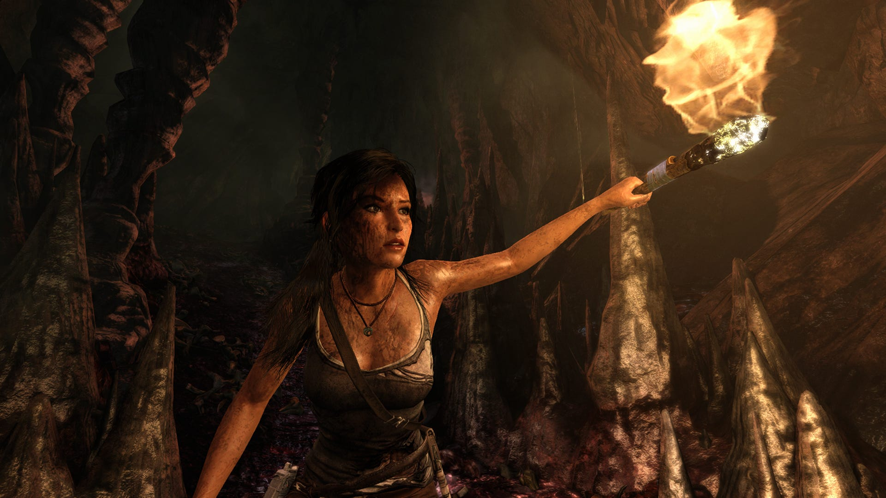

my first real experience with the *Tomb Raider* franchise and Lara Croft as a character. simply told, it's very a conventional and mild game<b>:</b> fun exploration and combat loop built around tactile puzzles and platforming sequences, if a little stilted and contrived, nor very challenging. the same can be said about the narrative. it's not as boring as it is benign, and none of the characters ever really mature beyond their initial pick-and-play trope cutouts, though some are more offensively flat than others, like Sam and Alex. Lara Croft is... well, to be honest, i don't know what. she's not a much more strongly defined personality than those in the cast around her, but i can't help the sense that she's caught between the dichotomy of a plain avatar to self-insert into, and a real-deal character to both spectate and therefore be read as, because spectating the stuff that happens to her throughout this game kinda fucking sucks.

within the first hour of the game, Lara is subjected to what may be the most vapid and gratuitous sexual assault attempt i've seen in fiction in quite some time. for clarity, my problem with this isn't born out of prudeness or some weird aversion to explicitly taboo content, but because it's such a damning indictment of how the rest of Lara's tribulations are framed for the entirety of the game's runtime. beyond my initial "*YEEEOWCH!!*" reaction to every subsequent injury or death scene, a sour aftertaste followed, induced by a perverse, voyeuristic underscoring of the violence on screen, then punctuated by a mandatory ceremony of heaving and sobbing. when sharing this sentiment to friends during my first playthrough, the first response i got was "self-report?" with the light-hearted insinuation that i was only seeing something i was looking for. which, to be fair, may be true, but i'd argue (and i did), that it isn't less any damning if this perversion is so easy to find and recognize. under any kind of critical lens, the only proper explanation for it is misogyny, intentional or otherwise, all the way down. fetishistic tokenization of women's suffering wins again. a real shame.

for as much as i labored over that last point, i have to admit i did enjoy the raw gameplay, even if the last bit left me bitter. it really is a title deeply entrenched in the conventions of early-2010s game design, for better (tactile combat, satisfying linear progression, etc.) and for worse (shallow RPG elements, obnoxious platforming, etc.). even though i'm not (yet) cognizant enough of my own sensibilities as a gamer to say with absolute certainty whether that scale tips more towards better or worse, i wouldn't go so far as to say that it's an impossible foundation to salvage from moving forward. i can only hope that the rest of the reboot trilogy improves from here, for no other reason than having more recent release dates.

probably for the best that i missed this one as an 8 year old.