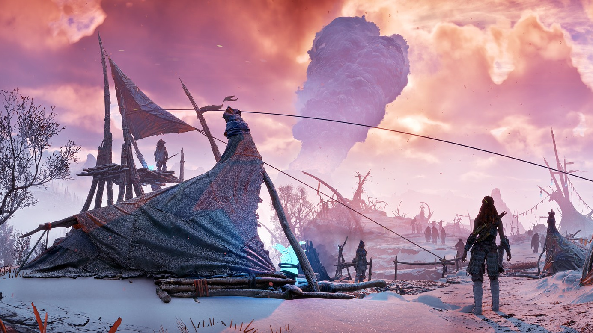

a little odd how stringently this game seems to resist critical inspection, both in and outside of its diegetic action-adventure rpg vortex; the syrup just goes down too smoothly, with combat and exploration systems as engaging as they are measured, considered, and deeply concerned with checking the right boxes, conforming to focus-tested feedback bullet points. i'm doing all the right things in just the right order, having fun in all the right places. it's good, sure, but not nearly as ambitious as the high-profile visuals and narrative might've suggested. can't harp on the action's lack of depth too much tough, considering how hard it is to imagine any adornments or modifications made in pursuit of complexity that wouldn't squander what's already satisfying about the experience; the base formula's competent, but too constrictive to account for new variables, and the endpoint of most criticisms i could make of it would just be me wishing i was playing a different game, which isn't really fair. i can only hope they remembered to throw out the kitchen sink before working away at their next one of these.

aside from all that superfluous shit the real payoff of this very serious critical reflection on my time spent with *Horizon Zero Dawn* was coming to the bittersweet conclusion that open-world games are just untenable structures of play. i found the best of what this game offered me in all its measured, self-contained bits: bandit camps, machine cauldrons, scripted set pieces, plucky side quests; the quality of which all had either nothing to do with or were actively hampered by their placement in a freely explorable open-world. it makes some sense to forgo the traditional rpg structure of interconnected levels and zones in order to deliver more potent moments of exploration and discovery for the player to experience, but this unfortunately comes at the steep cost of eviscerating any tension in the moment-to-moment combat by letting you beeline back to your grave from the nearest campfire at no cost. at the very least, dying in a cauldron or bandit camp resets the game state to neutral, moving pieces and all; come back with an alternative approach, more resources, re-quipped weapon wheel. the open-world encourages no such thoughtfulness, not in gameplay, and certainly not in traversal (i assume the piss marked climbing sequences and lack of ledge mantling were just fun bonus insults). in the end, the greatest reward for engaging in the open-world systems was faster access to the linear stuff. 

ludonarrative dissonance may be an over-saturated term at this point, but as long as developers are keen on haphazardly grafting B-movies onto their gameplay structures we're gonna have to keep circling the drain. for a story so concerned with the climatic fallout of a post-post-apocalyptic world overrun with biomimetic robots and technosaurs, it's funny that combat and hunting are the only meaningful modes of interaction with that world provided to the player, pokédex collect-a-thon seemingly thrown in as an afterthought. if you're curious about the specifics of ludoethics here as it relates to climate change, [Megan Condis goes into depth](https://gamestudies.org/2003/articles/condis) on that much better than i ever could, but just know the narrative-to-action interface never quite clicked beyond a surface-level for me. i did really enjoy Aloy's persistent and biting snark throughout the game's ""cinematics"" though, so again, can't hate too hard.

not sure that i'm ready for another 40-hour dose of this, but a friend has since reported to me that they've got real deal yuri in the next one, so i'll certainly be back at some point for another scoop of too-smooth-syrup™. can't say it'd be anytime soon though, i've got more of an affinity for the coarse organic stuff.