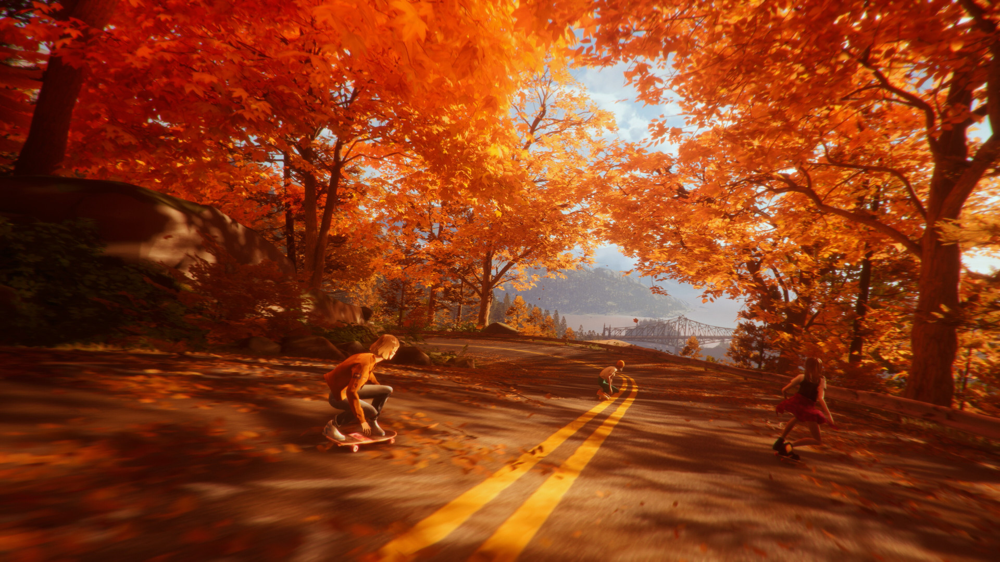

i've no aversion to games trying to be movies, really, but developers need to start making better ones cuz this just isn't a great look<b>:</b> engineered, cynical, and hollow, fashioning nondescript 1990s nostalgia semiotics into a cudgel to bash the player's head in with every few minutes for three consecutive hours. i mean, there were too many degrees of separation between me and the game's presupposed aesthetic ethos anyway<b>:</b> age, race, social environment, music taste, etc., but even observing from a distance, it's surprising how formless and uncritical this game's rendering of the past is.

if the protagonist throwing out a tape with Alice Coltrane's "[*Galaxy In Turiya*](https://youtu.be/9JNTH65qebA)" on it and her subsequent exclusion from the game's canonical soundtrack is any indicator, *Mixtape* is wholly uninterested in presenting a serious look at the cultural landscape of the 80s and 90s. instead it invites the player to peer through its voyeuristic lens over a white, suburban America, complete with cringey misadventures, underage drinking, and faux-rebellious anarchy, painting a pretty yet inauthentic cultural picture in the process.

the interactive playlist structure of the game functions as literal and figurative simulacrum that precludes both cultural and artistic interiority. Stacey introduces each track like a sterile radio announcer under the pretense that she has devised the "perfect" mixtape for the subsequent narrative events, and as such, there's no room for deviation or exterior judgement. the aforementioned "*Galaxy in Turiya*" track is used as a punchline, made out to be hoe-scaring music, set to an ugly depiction of two teenage characters kissing. it wasn't Stacey's pick, so it doesn't get a stamp of approval. the game very rarely makes any attempt at presenting its licensed songs as tangible works of art that human beings made, whose cultural, social, or artistic interiority might have some kind of connection to the narrative. its inclusions and exclusions are made just as carelessly, with a bizarre pick from Mitch Murder's 2013 EP "*This is Now*", making it in to the soundtrack. sure, i guess, but even weirder<b>:</b> this is a game whose main cast of protagonists are rebellious skaters in suburban California. why is there no attempt at passing attention over the intersection of rap, hip-hop, and skating counter-culture in the late 80s and early 90s? beats me, but if this is how *Mixtape* wants to the treat and present its music selections, maybe it's for the best they left that bit untouched.

*Mixtape*'s cast of characters are also woefully lacking in interiority, never really developing beyond pick-a-trope cardboard cutouts, and the protagonists adjacent to Stacey are made all the flatter in service of telling a story keen on keeping her interests in the spotlight. the main source of conflict at the heart of the narrative is Stacey's decision to "follow her dreams" with a spontaneous flight to New York, gambling on a slim chance at becoming professional music supervisor. this flight gets in the way of the gang's (long) pre-established plans to embark on one final road trip before they all split up for college. tension boils in the background as you work your way through the interactive playlist of Stacey's memories. throughout the game's runtime you're never given the impression that Stacey properly understands how choosing to leave her friends behind affects them emotionally, and she seems staunchly opposed to doing so. when Cassandra blows up about this in Stacey's face, all she can do is lament the broken flow of her mixtape picks; Portishead's "[Roads](https://youtu.be/7nxWP9BhI7w)" comes on when she's at a loss for what to play, but no introspection follows.

by the time the gang's inevitable make-up occurs, *Cassandra* is the one who has to lighten up about Stacey's decision to leave; Slater is encouraged to share the fruit of his creative labor with someone whose love for music precludes making any of her own; and we invariably end on *Stacey's* happy ending, the only character whose interiority matters. acquiescence is a given. take that prudent flight to New York, Stacey, the world was always your oyster anyways.

<b>...</b>

i've had just the right amount of this game, honestly, but it seems like everyone else can't get enough. even a cursory glance at the online conversations surrounding it is enough to give me a headache, so i'd prefer to sidestep the vortex. you've already seen it anyways<b>:</b> the fallout of IGN's glowing review of the game, accusations of *Mixtape* being an industry plant, especially odd diatribes over its lack of interactivity, questions about the validity of Beethoven & Dinosaur's label of "indie studio", so on and so forth. i'll let my peers litigate the veracity of these discussions. i'm cool off it.

ok, well, to tell the truth, in the past few days i've grown an even deeper resentment of the gamergate 2.0 discourse machine™ that has ground *Mixtape* to dust in its gears. both in preliminary development stages and post-hoc social contention, it's unbelievable that *this* game—yet another vapid envisioning of the past by old, out-of-touch, and cynical white folks—is apparently deserving of all our resources and attention. systemic inequality, economic strife, and dwindling job opportunities are still plaguing both the game dev and games media industry; the writers at IGN whose reviews lend fuel to the discourse machine™ are surely overworked and underpaid, but being what's left of an increasingly constricted workforce, they sit squarely in the center of *Mixtape*'s targeted demographic, and the scores reflect that fact. the kinds of people left at legacy media who may have scrutinized this game further than their peers are now few and far between.

who gets the largest slice of the pie to make video games? who gets access to the largest platforms to talk about them? *Mixtape* signifies to me that we've made less progress than we think in sustaining an industry open to more diverse, culturally-enriched groups of artists, developers, writers, critics, you name it; honestly, a whole lot less than most people would like to admit. on either side of the aisle, it's more money and more attention devoted to white normativity. perfect 10s beget perfect discourse.

see you all in two weeks for the next One Of These, or maybe not. in a media landscape as hollow and lacking interiority as this, i don't expect anything notable to "hit the charts" again for a while.